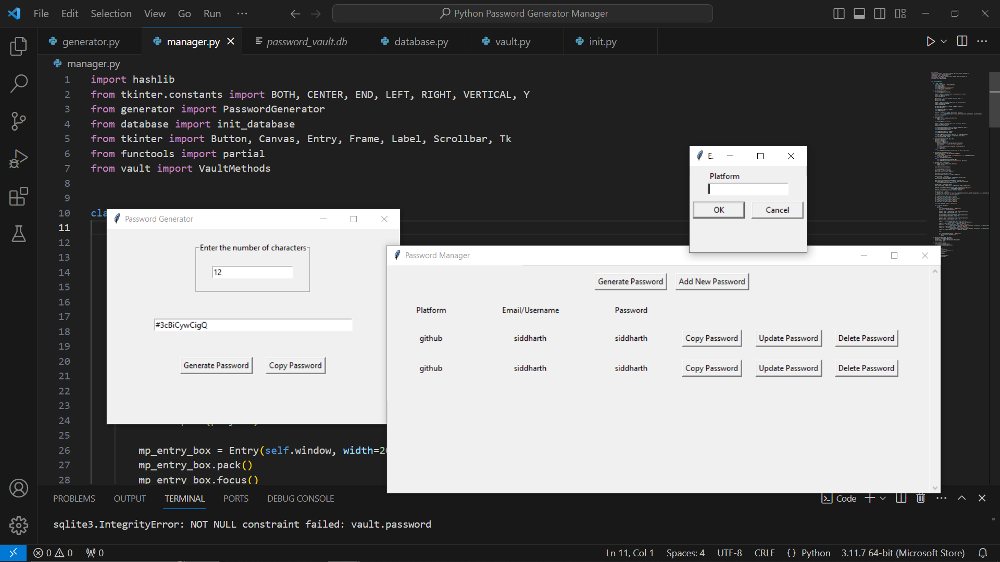

# Password Manager & Generator Vault App

This is a Python-based Password Manager and Generator Vault application built using `tkinter` for the graphical user interface, `sqlite3` for the database, and `hashlib` for password encryption. The app allows users to securely store and manage their passwords, as well as generate strong, random passwords.

## Features

- **Password Generation**: Generates strong passwords with customizable length, including uppercase letters, lowercase letters, numbers, and symbols.
- **Master Password**: Protects the vault with a master password. The master password is hashed and stored securely.
- **Password Vault**: Stores platform-specific usernames and passwords securely in a local SQLite database.
- **Password Management**: Add, update, and delete entries in the password vault.
- **Clipboard Copy**: Easily copy generated or stored passwords to the clipboard.

## Project Structure

```plaintext
password-manager/
│
├── database.py           # Handles database initialization and schema creation
├── generator.py          # Password generator with a Tkinter-based UI
├── init.py               # Initialization module for the main application
├── manager.py            # Main application logic and UI for the password manager
├── vault.py              # Handles adding, updating, and deleting vault entries
├── Screenshot_workflow.png # Visual representation of the app workflow
├── README.md             # Project documentation
└── requirements.txt      # Dependencies for the project (if needed)
```

## Getting Started

### Prerequisites

- Python 3.x
- SQLite3 (comes pre-installed with Python)
- Tkinter (comes pre-installed with Python)

### Installation

1. **Clone the repository**:

   ```bash
   git clone https://github.com/yourusername/password-manager.git
   cd password-manager
   ```

2. **(Optional) Create a virtual environment**:

   ```bash
   python -m venv venv
   source venv/bin/activate  # On Windows use `venv\Scripts\activate`
   ```

3. **Install dependencies** (if any are listed in `requirements.txt`):

   ```bash
   pip install -r requirements.txt
   ```

### Running the Application

1. **Run the `manager.py` file**:

   ```bash
   python manager.py
   ```

2. **Initial Setup**:

   - The first time you run the application, you will be prompted to create a master password. This master password will be used to access your vault in the future.

3. **Using the Password Manager**:

   - After logging in with the master password, you can:
     - Generate a new password using the integrated password generator.
     - Add new platform-specific passwords to the vault.
     - Update or delete existing passwords.
     - Copy any stored password to your clipboard for easy use.

### Files Overview

- **`database.py`**: Initializes the SQLite database and creates tables for storing the master password and vault entries.
- **`generator.py`**: A Tkinter-based password generator that allows users to specify the length of the password and then generates a random password consisting of uppercase letters, lowercase letters, numbers, and symbols.
- **`manager.py`**: The main file that starts the application. It includes the logic for managing the master password, logging in, and displaying the password vault UI.
- **`vault.py`**: Contains methods for interacting with the vault, including adding, updating, and removing password entries.

## Workflow Screenshot

Below is a visual representation of the app's workflow:



## Security Considerations

- **Master Password**: The master password is hashed using MD5 before being stored in the database. For a production-grade application, consider using a stronger hashing algorithm such as bcrypt or SHA-256.
- **Local Storage**: Passwords are stored locally in an SQLite database. Ensure that this database file is secure and not accessible by unauthorized users.

## Future Improvements

- **Stronger Hashing**: Implement a more secure hashing mechanism for the master password.
- **Password Strength Indicator**: Add a feature to indicate the strength of generated passwords.
- **Encryption**: Encrypt the stored passwords in the database for additional security.
- **Export/Import**: Provide options to export and import passwords.
